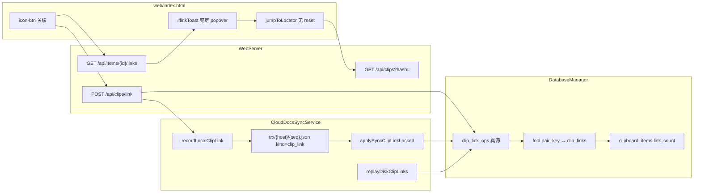
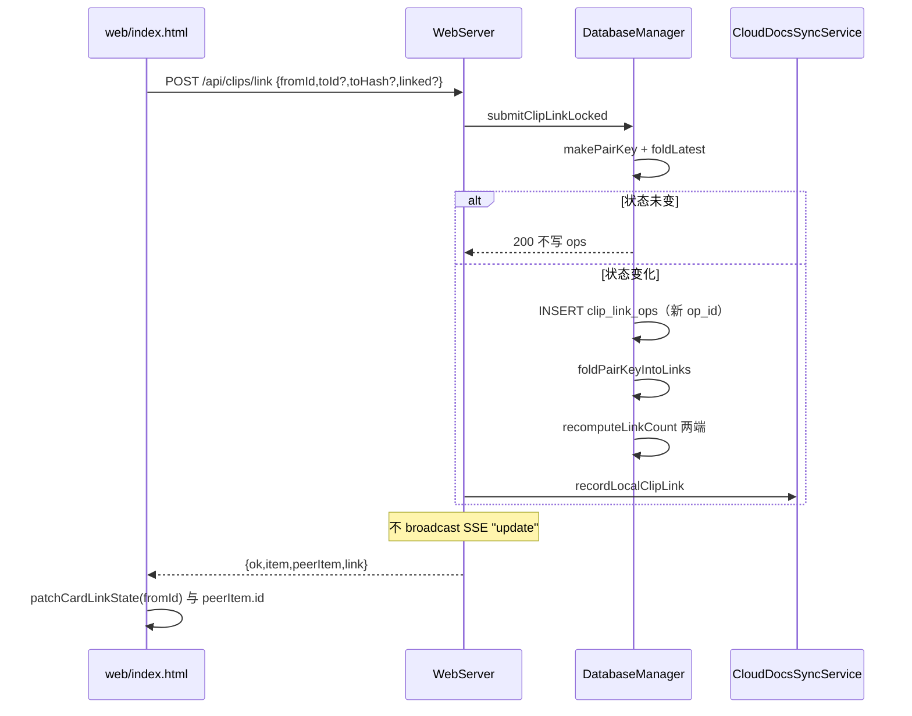
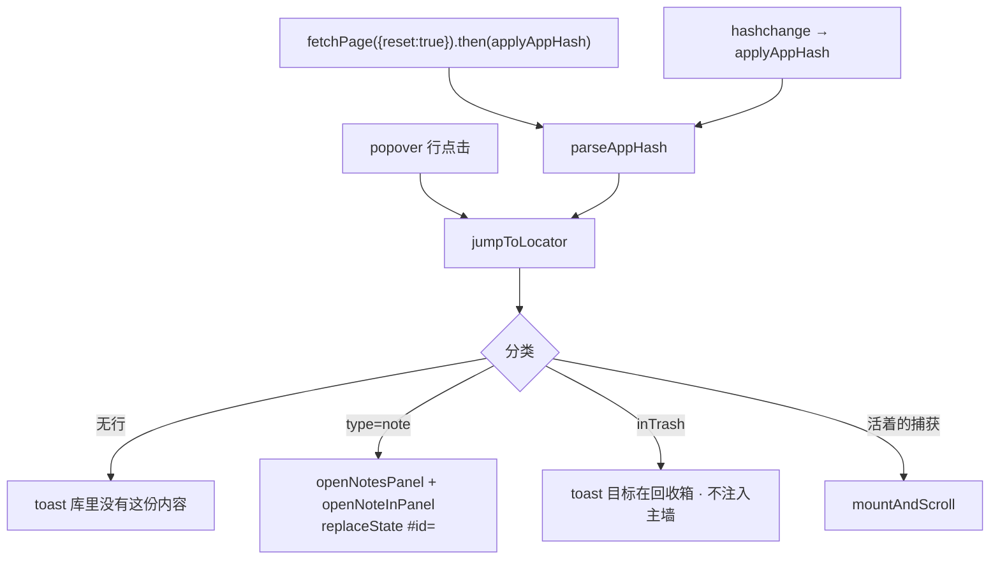

# ClipVault 卡片关联（clip link）

| 项 | 值 |
| --- | --- |
| 文档 | `docs/feature-clip-link.md` |
| 作者 | sunmingqiang (@DavidMusk93) / Grok Build |
| 日期 | 2026-08-28 |
| 状态 | Draft（评审修订） |
| 产品 | ClipVault（仓库历史名 ClipView / ClipFlowServer） |
| 仓库 | `/Users/bytedance/Documents/trae_projects/recallfs/projects/clipvault` |
| 对照 | `docs/feature-url-archive.md` · `docs/design-taste.md` · `AGENTS.md` |

---

## Overview

用户要把「值得留下」的剪贴卡片互相连起来：从一张卡跳到另一张，而不是靠搜索回忆。关联是 **Judgment 层**（和置顶、评价、划线同类），不是 Capture：禁止改 `html_content` / `text_content` / 图字节。

本设计把用户口头的「用 content hash 当 id」拆成两层：

| 层 | 标识 | 用途 |
| --- | --- | --- |
| 行身份 | `clipboard_items.id`（UUID） | 卡片 PK；bump 不换行；Compose 笔记编辑也不换行 |
| 内容身份 | `content_hash`（SHA-256 hex 64，小写） | **exact** latest-alive 定位器；深链 `/#h=<hash>`；捕获类目标的耐久指针。**不**回落 `text_hash` |

存储为 **append-only `clip_link_ops`（真源）+ 当前边投影 `clip_links`**。投影永远是「每个 `pair_key` 最新一条 op 的 fold」，不是「这条 op 自己去 UPSERT/DELETE」。跨机走 `CloudDocsSyncService` trx kind `clip_link`（必须 `recordLocalClipLink`，与 pin 同纪律）。

UI 不进图、不上 Notion 式 backlinks 栏：一颗与评价同槽的 32×32「关联」按钮，弹出与 ×N 同构的锚定毛玻璃 popover。跳转 **禁止** `fetchPage({reset:true})`；现有 `replaceCardInPlace` **不能**把墙外卡挂进 DOM，离页跳转走 `rebuildFromData({ preserveScroll: true })`（与 `mergeHead` 插入新 id 同一条路）。

---

## Background & Motivation

### 当前身份模型（必须守）

`saveItemDetailed`（`DatabaseManager`）两条 bump 路径：

```text
1. findIdByContentHash(payload.hash)     # exact 字节
2. 若未命中且 type ∈ {text, html, rtf}:
     findIdByTextHash(semanticTextHash)  # 可见正文
→ bumpLatestAlive：同一 UUID，copy_count++
→ bumpLatestAlive 不改 content_hash（只动 timestamp / source_app / copy_count / 必要时 html 填空）
→ 同步 kind=touch（已有）或 upsert（新行）
```

因此 **同一 UUID 上可以留下「赢家」的旧 `content_hash`，而后来那份不同字节的 payload 从未成为该行的 hash**。`findIdByContentHash(失败者的 hash)` 返回 nil，即使用户眼里「还是那段字」。这是 RTF/HTML 包装变化的已知行为，不是 bug 要在关联里修。

关联与深链的产品规则与 `docs/design-taste.md` 一致：**主规则仅 exact `content_hash` latest-alive**。hash miss → 「库里没有这份内容」。`text_hash` 只用于捕获去重，不当 locator、不进 `pair_key`、不进 `#h=`。

残留重复行由 `dedupeStaleBatch` 删掉（置顶 / 归档 / `reader_ops` 保护；本功能再保护 `clip_links` / `clip_link_ops`）。片段折叠（substr-fold）已回滚。

`itemToJSON`（`WebServer.itemToJSON`）已经下发 `id` + `contentHash`。前端卡片主键是 UUID；hash 目前只出现在操作日志面板。

`findIdByContentHash` 今日为 **private**。PR1 必须公开薄封装 `fetchItemByContentHash`（SQL 不变）。

Compose 笔记是反例：`ComposeNotes.contentHash(id:body:)` = `SHA256("compose\n{uuid}\n{body}")`，每次编辑改 hash、**不改** `id`（`saveComposeNoteLocked`）。因此 **笔记不能用 content_hash 当目标**。

### 痛点

1. 相关片段（一篇归档、一段引用、一张图、一篇自己的笔记）只能靠搜索或滚墙，没有「这块跟那块有关」的判断记录。
2. 若把关联写进正文（markdown 链接 / 在 HTML 里嵌 hash），会毁掉 Capture 不可变、hash 去重和同步审计。
3. 若只用 UUID 当目标，对端若先有另一 id 的同 hash 行，`applySyncUpsertLocked` 会 bump 本地行并丢掉远端 id。hash 才能在跨机 latest-alive 下仍指向「那份内容」。
4. 置顶/归档/阅读态曾经只写本机 SQLite，对端 `lag=0` 却看不到钉子（nmem `clipvault_sync_judgment_layers_20260814`）。关联若只写本机，会再犯一次。

### 产品落层

nmem `clipvault_design_philosophy_layered_memory_20260814` 五层里，clip link 落在 **Judgment**：

| 层 | 本功能 |
| --- | --- |
| Capture | 不动 |
| **Judgment** | 手动 `related` 边 + 投影 `link_count` |
| Archive / View / Runtime | 不动 |

---

## Goals & Non-Goals

### Goals

1. 手动把两张「值得留下」的卡片标为 `related`，可取消。
2. 捕获类目标用 **exact** `to_content_hash` 定位 latest-alive；笔记目标用 `to_item_id`（UUID）。
3. 列表只露密度：有关联时按钮 `has-ctx`；详情 lazy 进锚定 popover。
4. 从 popover 跳到目标卡：墙不整页重置、滚动位置保留；墙外卡必须 **真正挂上 DOM**（`isConnected`）。
5. 深链 `/#h=<content_hash>` 在 **首屏 `fetchPage` 完成之后** 解析；与已有 `/#notes` 共存。
6. 跨机：本机写入必 `recordLocalClipLink`；trx 无 blob；旧端跳过 unknown kind 后升级能 replay；apply 重放不得卡死该 host 的后续 cursor。
7. 用户可见文案中文。

### Non-Goals（首期不做）

| 不做 | 原因 |
| --- | --- |
| 瀑布流上画图 / 力导向 | 密度与抖动；万级墙不可承受 |
| Notion 式双向链接面板、属性数据库 | 不是团队笔记产品 |
| 自动把正文里 SHA 状字符串当链接 | 误伤 git commit / 镜像摘要 |
| 多种 kind（`cites` / `follows` / `duplicate`） | 词汇从 `related` 起 |
| 改 capture 正文、在 HTML 里插入 `<a href="#h=">` | 不可变 + 墙 · URL 双面：预览禁可点链 |
| 用 `text_hash` 当关联目标 **或 locator 回落** | 可见正文去重 ≠ 用户点的那份 payload；`#h=` / hash-only POST  miss → 「库里没有这份内容」 |
| Android 写关联 / 野外记事本互链 | 备份阅读器；P3 只读可跟 |
| 把笔记编进瀑布流 | 已有 `exclude=note` + `#notesPanel` |
| 遥测、云图分析 | 个人产品；只用现有本地 `operation_logs` |
| `keepsake_meta` feature flag / `GET /api/meta` | 个人双机；回滚靠换二进制 / web，不发明开关 |

---

## Key Decisions

| # | 决策 | 理由 |
| --- | --- | --- |
| K1 | **hash 是 exact 内容定位器，不是行 PK；不回落 `text_hash`** | `findIdByContentHash`；用户说的「用 hash 当 id」落在 locator / 深链。text-like bump 可能把不同 `content_hash` 叠到一行且 **不改行上 hash**，`#h=失败者` 诚实 miss |
| K2 | **关联是 Judgment；`clip_link_ops` 真源，`clip_links` 是 per-`pair_key` 最新 op 的 fold** | 与评价/划线同构；link/unlink 是开关，单条 op 就地 UPSERT 会被乱序 replay 复活 |
| K3 | **捕获目标 = `to_content_hash`；笔记目标 = `to_item_id` + `to_is_note=1`** | Compose 每次保存改 hash（`ComposeNotes.contentHash`） |
| K4 | **`to_item_id` 对捕获目标只是写入瞬间的 latest-alive 快照** | 加速跳转；解析时若该行已死或 hash 不一致，回退 `findIdByContentHash` |
| K5 | **trx kind 单数 `clip_link`，payload 进 `note` JSON；apply 信任 `note.pair_key`，不重算** | 与 `reader_op` 相同；对端可能还没有 from/to 行，重算会得到空 hash |
| K6 | **UX 唯一入口 = action-pair 32×32「关联」按钮**；popover 克隆 ×N 锚定玻璃卡 | 评价已证明「主卡不挂正文」；header 再加 chip 会与 ×N 双入口。`linkCount>0` 时 `has-ctx` |
| K7 | **展示按无向 `related`，存储按有向（from = 用户当时站的卡）** | 一边写入；读取三向查；`pair_key` 去重反向边；unlink 从 **任一端** 重算同一 `pair_key` |
| K8 | **跳转禁止 `fetchPage({reset:true})`；禁止用 `replaceCardInPlace` 当 insert** | SSE `clip_deleted` 血泪；`replaceCardInPlace` 只在 `old.parentNode` 上 `replaceChild` |
| K9 | **旧二进制会 skip unknown kind（`applyIsIdempotentSuccess` default true）** | 必须 `replayDiskClipLinks`。新二进制：`clip_link` 列入非 default；apply **五步顺序**（缺 from → false 且不 insert；其余一律 true）。禁止用 `false` 抑制 SSE |
| K10 | **kind 词汇首期只有 `related`** | 拒绝其它字符串 |
| K11 | **不自动扫描正文里的 SHA** | 可选后期：整段 payload **恰好等于** 已有 `content_hash` 再提示 |
| K12 | **列表投影 `link_count`，详情 lazy** | 万级墙不能每卡 JOIN |
| K13 | **P1 `mergeHead` 必须 overlay `linkCount` 并 `patchCardLinkState`** | 今日 `mergeHead` 只抄 archived/pin 字段，会丢掉 JSON 里的 `linkCount`。SSE `clip_linked` 仍可留 P2（同机第二 tab） |

---

## Proposed Design

### 身份与解析

```text
                    ┌─ type=note ──► 目标身份 = item UUID
用户点「关联到」───┤                 to_is_note=1, to_content_hash=NULL
                    └─ 其它 type ──► 目标身份 = content_hash（小写 64 hex）
                                      to_content_hash=exact
                                      to_item_id=当时 latest-alive（可空、可过期）
```

所有入站 hash（API、深链、trx `content_hash`）先 `normalizeHash`：`lowercased`，匹配 `^[0-9a-f]{64}$`，否则 400 / 忽略。库内 `ClipboardMonitor.computeHash` / `ComposeNotes.contentHash` 已是 `%02x` 小写。

`resolveByContentHash`（深链、`GET ?hash=`、hash-only POST 共用）：

```text
id = findIdByContentHash(normalizeHash(h))   # 仅此一条；禁止 findIdByTextHash
无行 → missing
有行 → 原样返回（含 inTrash / type=note）；由调用方分流，不在 SQL 里丢掉软删
```

`resolveLinkTarget`（已有边、带 `toId` 的 POST）：

```text
if to_is_note:
    fetchItemById(to_item_id)
    missing? → unresolved
else:
    if to_item_id 仍活着 AND row.content_hash == to_content_hash:
        use that row          # 快照命中
    else:
        resolveByContentHash(to_content_hash)
```

`findIdByContentHash` SQL（不变）：

```sql
SELECT id FROM clipboard_items
WHERE content_hash = ?
ORDER BY CASE WHEN deleted_at IS NULL THEN 0 ELSE 1 END,
         timestamp DESC, id DESC
LIMIT 1;
```

#### RTF / 同可见正文、不同 `content_hash`

| 场景 | 行为 |
| --- | --- |
| 两份 RTF 可见正文相同、字节不同 → `text_hash` bump 到同一 UUID，行上仍是 **先到者** 的 `content_hash` | 正常捕获去重，关联不改 |
| `#h=<后到者 hash>` 或 hash-only POST `toHash=<后到者>` | **miss** → 空列表 / 400 以外的「库里没有这份内容」 |
| `#h=<行上现存 hash>` | 命中该 UUID |
| POST 带 `toId` | 采用 **服务端该行** `content_hash` 写入边（安全；不信客户端 hash） |

不把 `text_hash` 做成 locator：会把「字体表变了的另一份 RTF」和用户复制的指纹混成一份，违反 exact hash 主规则。

### 无向去重 `pair_key`

`related` 在 UI 上是无向的：A 连 B 后，从 B 也应看到 A。只存一条有向边，反向不写第二行。

`makePairKey(fromItem, toTarget)` — 按 **类型** 而不是「当时的笔记 hash」：

```text
normalizeUuid(id) = UUID.uuidString（Foundation 默认大写）
normalizeHash(h)  = lowercase 64 hex

fromNote = from.type == note
toNote   = to.isNote || to.type == note

if fromNote && toNote:
    pair_key = "nn:" + min(from.id, to.id) + ":" + max(...)     # uuid 字典序
elif fromNote xor toNote:
    pair_key = "nh:" + note.uuid + ":" + capture.content_hash   # 笔记永远在前，不用 min
else:
    pair_key = "hh:" + min(from.hash, to.hash) + ":" + max(...)
```

禁止用笔记的 `content_hash` 拼 `hh:`（编辑后即变）。HTTP **允许** `from.type==note`（笔记栏 `#notesLink`）；apply/sync 折 `nh:` / `nn:`。

`clip_links.pair_key` PRIMARY KEY。unlink 不要求「必须是原来的 from」：站在 B 上取消时，用 B 当 `fromId` 再 `makePairKey`，得到同一无向键。

### 架构



### 写路径（可实现伪代码）

```text
func submitClipLinkLocked(fromId, toId?, toHash?, kind, linked, source) -> Result
  kind = kind ?? "related"
  if kind != "related": 400 暂只支持 related

  from = fetchItemById(fromId)
  if from == nil: 404 找不到卡片
  if from.deletedAt != nil: 400 回收箱里不能关联
  if from.deletedAt != nil: 400 回收箱里不能关联
  # from.type==note 已允许（笔记栏发起）；apply 同样 fold nh:/nn:

  to = resolvePostTarget(toId, toHash)                   # 见下
  if to.missing: 404 找不到要关联的卡片
  if to.id == from.id: 400 不能关联自己
  if !to.isNote && to.contentHash == from.contentHash: 400 不能关联自己

  pairKey = makePairKey(from, to)
  current = foldLatest(pairKey)                          # 最新 op；无则 nil

  if linked:
    if current?.action == "link":
      return 200 已有边，不 insert ops，不 enqueue        # 真幂等，不发第二笔 trx
    if degree(from) >= 32 || degree(to) >= 32:
      400 最多 32 条关联                                 # 两端都查；已链的 pair 上面已 return
    op = appendOps(action:"link", from_item_id:from.id,  # 新 UUID = op_id
                   to_content_hash: to.isNote ? nil : to.contentHash,
                   to_item_id: to.id, to_is_note: to.isNote,
                   pair_key: pairKey)
  else:
    if current == nil || current.action == "unlink":
      return 200 无边，不 insert，不 enqueue
    op = appendOps(action:"unlink", from_item_id:from.id,  # from = 当前站的卡，可与原 from 相反
                   …same pairKey and target fields…)

  foldPairKeyIntoLinks(pairKey)                          # 读最新 op → UPSERT 或 DELETE
  recomputeLinkCountLocked(from)
  recomputeLinkCountLocked(to)                           # to 行若存在
  recordLocalClipLink(op)                                # 无 blob_keys
  return 200 { item: from, peerItem: to, link }

func resolvePostTarget(toId, toHash):
  if toId, let row = fetchItemById(toId):
    if row.type == note:
      return Target(isNote:true, id:row.id, contentHash:nil)  # 忽略客户端 toHash
    return Target(isNote:false, id:row.id, contentHash:row.contentHash)  # 服务端 hash
  hash = normalizeHash(toHash)                            # 否则必须合法 64 hex
  row = resolveByContentHash(hash)                        # 无 text_hash
  if row == nil: missing
  if row.type == note: 400 笔记请用条目关联
  return Target(isNote:false, id:row.id, contentHash:row.contentHash)
```



度数 cap：**两端** 的无向 `link_count`（已链的同一 `pair_key` 不重复计）。只查 from 会让 B 被大量 inbound 撑破 32。

### 跳转（无整墙 reset）

现有事实（实现必须面对，不能假设）：

| 符号 | 行为 |
| --- | --- |
| `replaceCardInPlace` | 仅当 `cardCache.get(id)` **已有 parentNode** 时 `replaceChild`。墙外卡会建节点写进 cache 但 **永不挂载** |
| `refreshClipInPlace` | `clips.unshift` + `replaceCardInPlace`，只对已在墙上的卡有效 |
| `fetchPage({reset:true})` | 清 `cardCache`、`rebuildFromData({preserveScroll:false})`；boot（脚本末尾）、搜索、类型 chip 会走它 |
| `#notes` | 脚本中段 `requestAnimationFrame(openNotesPanel)`，**早于** 首屏 `fetchPage` |
| `hashchange` | 今日无监听；`history.replaceState` 只用于 `#notes`，且 **不触发** `hashchange` |
| `is-flash` | Accent `outline` 2px + `scale(1.02)`；进视口后再亮、持 ~850ms；**禁止** `translateY` / 改 `border-width` |
| `parseAppHash` / `jumpToLocator` / `applyAppHash` | **新** |



`mountAndScroll(item)`：

```text
if currentView == 'trash':
    toast 目标不在回收箱; return          # 活卡不塞进回收箱墙
if searchQuery:
    if clips 里没有 item.id:
        toast 不在当前结果里; return      # 禁止把 miss 注入搜索结果（clientFilter 在有 q 时不过滤类型）
    # 已在结果里 → 往下滚
if currentFilter != 'all' && item.type 会被 clientFilter 藏起:
    currentFilter = 'all'                 # 只改 chip UI，不 fetchPage
    # 然后用当前 clips 继续

el = cardCache.get(item.id)
if el && el.isConnected:
    scrollIntoView({block:'center'}); flash(el)
else:
    把 item merge 进 clips（dedupeClipsById）
    rebuildFromData({ preserveScroll: true })   # 与 mergeHead 插入新 id 相同，会挂载
    requestAnimationFrame:
        el2 = cardCache.get(item.id)
        if el2 && el2.isConnected: scroll + flash
        else: toast 无法定位到卡片

history.replaceState(null, '', '#h=' + item.contentHash)   # 笔记用 #id=
```

**启动顺序（P0 硬约束）**

1. **不要**把 `#h=` 解析放在现有 `#notes` 那个 `requestAnimationFrame` 旁边（它在 `fetchPage` 之前，随后 reset 会清 cache、滚动回顶）。
2. `#notes` 保持现状（开面板，与墙无关）。
3. 脚本末尾改为：`fetchPage({ reset: true }).then(() => applyAppHash())`。
4. `window.addEventListener('hashchange', () => applyAppHash())`。`replaceState` 不触发该事件，不会死循环。
5. `parseAppHash`：`#notes` 只开面板；`#h=` 与 `#id=` 走 `jumpToLocator`。两者同时出现时 `#h=` 优先（深链主语义）。

`jumpToLocator` 内部只 `GET /api/clips?hash=` 或 `?id=` 拉 **一条**，禁止再 `fetchPage`。

### UI（taste）

对照 `docs/design-taste.md`：列表轻、无 hover `translateY`、同槽同尺寸、中文。

**入口（K6）**

- `card-actions .action-pair` 在评价铅笔 **左侧** 加一颗 `icon-btn`（32×32，与 pin/eval/copy/delete 同槽）。`data-link` 属性。
- `title` / `aria-label`：`关联`；有记录：`关联（N）`。
- `linkCount>0` → `has-ctx`（已有 `.icon-btn.has-ctx`）。
- **header 不加第二条 chip**。
- 回收箱卡片不提供关联（trash 只留恢复）。

**popover `#linkToast`（新 DOM）**

视觉克隆 `#eventToast` / `.event-toast`（轻 scrim、14 圆角毛玻璃、从按钮中心 scale）。把 `positionEventToastCard` 抽成 **新** `positionAnchoredCard(anchorEl, cardEl)`，事件时间线改为调用它。

- 宽 `min(320px, 100vw-20px)`；高 `min(42vh, 360px)`
- 禁止从屏幕中心 scale；禁止整页 sheet

结构：

```text
关联
N 条 · 手动
────────────────
[ 搜索片段或笔记… ]
片段 | 笔记     ← chip，默认「片段」
────────────────
已关联
  [类型色 badge] 预览一行    跳转
                       取消关联（小、muted）
空态：还没有关联。搜一下值得留下的另一张。
```

搜索：输入 ≥1 字后 debounce 200ms，`GET /api/clips?q=&limit=12`（片段 tab `exclude=note`；笔记 tab `type=note`）。结果只填 popover，**绝不**改 `clips` / `fetchPage`。点结果 → POST link → 刷新 popover + `patchCardLinkState(from)` + `patchCardLinkState(peer)`。

跳转行：整行可点；`取消关联` 单独 `stopPropagation`。未解析目标：`（已不在库中）`，灰色，不可跳，可取消。

**禁止**

- 卡片 body 里渲染关联列表
- 预览区可点 `<a href="#h=">`（墙 · URL 双面）
- hover 位移 / 图可视化

### 同机可选后期：整段 payload 等于 hash

若新捕获 `type=text` 且 `textContent` trim 后 **恰好** 某条已有 `content_hash`：toast「这是已有卡片的指纹。要关联吗？」——**默认关**，本设计不实现。禁止在 git log / 长文本里 regex 扫描。

---

## API / Interface Changes

沿用现有风格：JSON 对象、`ok`、失败 `message` 中文。loopback 免登录；公网走已有 `publicRequestAuthorized`。

### 1. 列表 / 单卡 JSON

`itemToJSON` 增 `"linkCount": 0`（整数；旧前端忽略）。`ClipboardItem` 增 `linkCount: Int = 0`。

**单一列清单**，禁止五处各写一遍：

```swift
// html 列：列表用 listHtmlSQL / listHtmlSQLAliased；fetchItemByIdLocked 用 html_content
static let listTailSQL = """
COALESCE(copy_count, 1), deleted_at, first_seen_at,
user_note, user_stage, user_rating, user_context_updated_at,
pinned_at, archive_html_sha, COALESCE(link_count, 0)
"""
```

别名版 `listTailSQLAliased`（`c.copy_count` … `c.link_count`）给 FTS JOIN。

必须改到的 **五处**：

| 函数 | html 列 |
| --- | --- |
| `runSearchFTS` | `listHtmlSQLAliased` |
| `runSearchLike` | `listHtmlSQL` |
| `runList` | `listHtmlSQL` |
| `runPinned` | `listHtmlSQL` |
| `fetchItemByIdLocked` | `html_content`（全文）；**尾列仍用 `listTailSQL`** |

`rowToItem`：`link_count` 为第 19 列（0-based 19），读取条件 `colCount >= 20`。现有 `archive_html_sha` 已是 `colCount >= 19`。**把 `link_count` 加在 SELECT 末尾** 时，漏改某一处 SELECT **不会错位读 archive sha**，只会得到 `linkCount=0`。风险是 picker/搜索卡按钮不亮，不是读串列。禁止把新列插进中间。

### 2. `GET /api/clips?hash=`

与已有 `?id=` 并列（`sendItemsJSON`）：

```http
GET /api/clips?hash={64hex}&limit=1
→ { "items": [ itemToJSON ], "count": 1, "nextCursor": null }
```

- 非 64 hex → 400 `{ok:false,message:"hash 格式不对"}`
- 无行 → `{items:[], count:0}`（与未知 id 一致，不当 404）
- 解析 = `resolveByContentHash`（**无** `text_hash`）。可能返回 `inTrash` 或 `type=note`；**分流在前端 `jumpToLocator`**，API 不 404、不改写 type

### 3. `GET /api/items/{id}/links`

对齐 `/evaluations`、`/events`：

```http
GET /api/items/{uuid}/links?limit=32
→ { "ok": true, "id": "<uuid>", "linkCount": 2, "links": [ LinkJSON ] }
```

`LinkJSON`：

```json
{
  "opId": "<uuid>",
  "kind": "related",
  "pairKey": "hh:…",
  "fromId": "<uuid>",
  "toHash": "<64hex|null>",
  "toId": "<uuid|null>",
  "toIsNote": false,
  "direction": "out",
  "ts": 1780000000.0,
  "resolved": {
    "id": "<uuid>",
    "type": "text",
    "preview": "……",
    "contentHash": "<64hex>",
    "missing": false,
    "inTrash": false,
    "isCompose": false
  }
}
```

- `direction`: 相对请求的 `{id}`，`out` = 该卡是 from；`in` = 该卡是目标。
- `preview` 服务端截断 ≤80 字，纯文本。
- 双向：`from_item_id=? OR to_item_id=? OR (to_is_note=0 AND to_content_hash=当前卡.hash)`。
- `limit` 硬顶 32。

### 4. `POST /api/clips/link`

```http
POST /api/clips/link
{
  "fromId": "<uuid>",
  "toId": "<uuid>",
  "toHash": "<64hex>",
  "kind": "related",
  "linked": true
}
```

规则见上文伪代码。要点：

| 字段 | 规则 |
| --- | --- |
| `fromId` | 活着的行（捕获或笔记） |
| `toId` / `toHash` | 至少一个 |
| `toId` 命中捕获 | **采用服务端 `content_hash`** |
| 仅 `toHash` | exact `findIdByContentHash`；命中 note → 400 |
| `linked` | 缺省 true；false = 取消；**按 `pair_key` 无向**，不要求 from 与建边时相同 |
| 幂等 | 状态未变 → 200、不写 ops、不 enqueue（不是靠 `INSERT OR IGNORE` 吃新 UUID） |

成功：

```json
{
  "ok": true,
  "item": { "…itemToJSON(from)，含新 linkCount" },
  "peerItem": { "…目标卡，若活着" },
  "link": { "…LinkJSON 或 null（unlink 后）" }
}
```

**不** `broadcastSSE("update")`（本 tab 已 `patchCardLinkState` from+peer）。对端机：`applyOpLocked` 返回 true 就会 `ClipFlowItemAdded` → SSE `update` → `mergeHead`（K13 overlay `linkCount`）。ignore/quarantine 同样可能多刷一次墙——接受，不为此把 apply 改成 `false`。同机第二 tab 的即时性留 P2 `clip_linked`。

### 5. 前端符号

| 符号 | 新旧 | 职责 |
| --- | --- | --- |
| `openLinkToast` | 新 | 锚定 popover，lazy GET links |
| `patchCardLinkState(itemId, {linkCount})` | 新 | 只改按钮 class / aria |
| `jumpToLocator` / `applyAppHash` / `parseAppHash` | 新 | 深链与 popover 共用 |
| `positionAnchoredCard` | 新（从 `positionEventToastCard` 抽出） | ×N 与关联共用 |
| `is-flash` | 新 CSS | 定位高亮，无位移 |
| `replaceCardInPlace` | 旧 | **仅**已挂载卡的节点替换；跳转 insert **不用它** |
| `rebuildFromData({preserveScroll:true})` | 旧 | 墙外卡挂载 |
| `mergeHead` | 旧，P1 必改 | 增加 `linkCount` overlay + `patchCardLinkState` |

测试：

- `jumpToLocator` / `hashchange` / `applyAppHash` 源码不含 `fetchPage({reset:true})`
- boot：`fetchPage` 的 `.then(applyAppHash)`（或等价 await）在脚本里 **晚于** `fetchPage({reset:true})` 调用点
- 墙外跳转路径出现 `rebuildFromData` + `preserveScroll`，不出现对未连接节点的 `replaceCardInPlace`

---

## Data Model Changes

### 新表 `clip_link_ops`（真源，append-only）

```sql
CREATE TABLE IF NOT EXISTS clip_link_ops (
    id TEXT PRIMARY KEY,          -- UUID = trx op_id
    ts REAL NOT NULL,
    action TEXT NOT NULL,         -- 'link' | 'unlink'
    from_item_id TEXT NOT NULL,
    to_content_hash TEXT,         -- 捕获目标；笔记为 NULL
    to_item_id TEXT,              -- 笔记目标耐久；捕获为快照
    to_is_note INTEGER NOT NULL DEFAULT 0,
    kind TEXT NOT NULL DEFAULT 'related',
    pair_key TEXT NOT NULL,
    source TEXT NOT NULL DEFAULT 'web'
);
CREATE INDEX IF NOT EXISTS idx_clip_link_ops_from_ts
    ON clip_link_ops(from_item_id, ts ASC);
CREATE INDEX IF NOT EXISTS idx_clip_link_ops_pair_ts
    ON clip_link_ops(pair_key, ts DESC);
```

`INSERT OR IGNORE` 只对 **同一 `id`（op_id）重放** 幂等。第二次点击会是 **新** `op_id`；本地 HTTP 在 fold 已是目标状态时根本不 insert（见伪代码）。

### 投影表 `clip_links`（fold，不是独立真源）

```sql
CREATE TABLE IF NOT EXISTS clip_links (
    pair_key TEXT PRIMARY KEY,
    from_item_id TEXT NOT NULL,
    to_content_hash TEXT,
    to_item_id TEXT,
    to_is_note INTEGER NOT NULL DEFAULT 0,
    kind TEXT NOT NULL DEFAULT 'related',
    last_op_id TEXT NOT NULL,
    updated_at REAL NOT NULL
);
CREATE INDEX IF NOT EXISTS idx_clip_links_from
    ON clip_links(from_item_id);
CREATE INDEX IF NOT EXISTS idx_clip_links_to_hash
    ON clip_links(to_content_hash) WHERE to_content_hash IS NOT NULL;
CREATE INDEX IF NOT EXISTS idx_clip_links_to_item
    ON clip_links(to_item_id) WHERE to_item_id IS NOT NULL;
```

`foldPairKeyIntoLinks(pair_key)`（每次 insert **之后**、replay 结束时对触及的 key）：

```sql
SELECT action, from_item_id, to_content_hash, to_item_id, to_is_note, kind, id, ts
FROM clip_link_ops
WHERE pair_key = ?
ORDER BY ts DESC, id DESC
LIMIT 1;
```

- 无行或 `action=unlink` → `DELETE FROM clip_links WHERE pair_key=?`
- `action=link` → `INSERT OR REPLACE` 整行（`from_item_id` 取 **最新那条 op** 的 from，可能与初次建边不同）

禁止「本条 op 与 `clip_links.updated_at` 比大小再 UPSERT」。unlink 后投影行消失，乱序的旧 `link` 再 UPSERT 会把边复活。`listJson` **无 `wall_ts` 排序**（`contentsOfDirectory` 顺序），`replayDiskClipLinks` 不得依赖文件序当 LWW。

正确 replay：

```text
replayDiskClipLinks:
  收集 trx/* 与遗留 ops/* 中 kind==clip_link 的文件（不要求排序）
  逐个 INSERT OR IGNORE clip_link_ops（以 op_id）
  对本次出现过的 pair_key 去重，逐个 foldPairKeyIntoLinks
  对触及的 from/to 行 recomputeLinkCountLocked
```

个人双机时钟可偏：fold 用 op.`ts`（= `wall_ts`）。不引入 HLC 比较。

### `clipboard_items.link_count`

```sql
ALTER TABLE clipboard_items ADD COLUMN link_count INTEGER NOT NULL DEFAULT 0;
```

`recomputeLinkCountLocked(itemId, contentHash)`：

```sql
SELECT COUNT(*) FROM clip_links
WHERE from_item_id = :id
   OR to_item_id = :id
   OR (to_is_note = 0 AND to_content_hash = :hash);
```

列表 **禁止** JOIN `clip_links`。

**必须在这些路径调用**（目标后到是 hash locator 存在的原因；不挂钩则 B 的按钮永远不亮）：

| 路径 | 何时 |
| --- | --- |
| `submitClipLinkLocked` | from + 已解析 to |
| `applySyncClipLinkLocked` | 同上；to 行缺失则只重算 from |
| `insertNewItem` | 新行可能匹配已有 `to_content_hash` |
| `bumpLatestAlive` | 同上（hash 未改，但仍可能是目标首次在本机「活着」） |
| `applySyncUpsertLocked` | 远端捕获落地 |
| `saveComposeNoteLocked` / `applySyncComposeLocked` | 笔记 UUID 目标 |
| `applySyncTombstoneLocked` | 行物理删除后，对仍指向它的边的 **对端** 重算（本行已不在） |
| 本地软删 / 恢复 | 与 tombstone 相同，重算自己（软删行仍在）和对端 |

实现上抽 `touchLinkCountsForItem(id, hash)`：查出涉及该 id/hash 的 `clip_links`，对每个端点 `recomputeLinkCountLocked`。单次 COUNT 在小表上可接受。

### 迁移

`migrateSchema()` 内 `CREATE TABLE IF NOT EXISTS` + `columnExists(...,"link_count")`。无历史数据，不必 backfill。

### `dedupeStaleBatch` 保护

现有：`pinned_at` / `archive_html_sha` / `reader_state` / `reader_ops`。追加：

```sql
AND NOT EXISTS (SELECT 1 FROM clip_links L
                WHERE L.from_item_id = c.id OR L.to_item_id = c.id)
AND NOT EXISTS (SELECT 1 FROM clip_link_ops O
                WHERE O.from_item_id = c.id OR O.to_item_id = c.id)
```

### 同步 trx

`SyncOp.kind` 注释扩为含 `clip_link`。`recordLocalClipLink`：

```swift
func recordLocalClipLink(
    opId: String,
    action: String,          // link | unlink
    fromId: UUID,
    toContentHash: String?,
    toItemId: String?,
    toIsNote: Bool,
    kind: String,
    pairKey: String,
    ts: Double
)
```

`makeOp(kind:"clip_link", itemId: fromId, item:nil, blobKeys:nil)` 然后：

- `op.opId` = 库内 ops.id
- `op.contentHash` = `toContentHash`（可空；仅提示，apply **不**用它重算 pair_key）
- `op.wallTs` = ts
- `op.note` = JSON：

```json
{
  "action": "link",
  "kind": "related",
  "to_item_id": "...",
  "to_is_note": false,
  "pair_key": "hh:...",
  "from_item_id": "..."
}
```

`blobKeys` 保持 nil。`needsBlob` 不因 `clip_link` 变 true。

`applyOpLocked`：

```swift
case "clip_link":
    return database.applySyncClipLinkLocked(
        opId: op.opId, itemId: uuid, noteJSON: op.note,
        contentHash: op.contentHash, wallTs: op.wallTs,
        source: "sync:\(op.host)")
```

Apply **信任** `note.pair_key`（缺则走下面第 1 步 quarantine）。不要用 `op.contentHash` 现场 `makePairKey`。

#### apply 返回值 ↔ cursor（硬契约）

Pull 只有 **一个** Bool（`CloudDocsSyncService` pull 循环）：

```text
changed   = applyOpLocked(op)                 // clip_link → applySyncClipLinkLocked
appliedOk = changed || applyIsIdempotentSuccess(op)   // clip_link → false
if changed { NotificationCenter ClipFlowItemAdded }   // → SSE "update" → mergeHead
```

`applyIsIdempotentSuccess("clip_link")` **必须是 false**（与 pin / `reader_op` 一样）。因此 cursor 能否前进 **只看** `applySyncClipLinkLocked` 的返回值。

**禁止**用 `return false` 表示「fold 没变、别刷墙」。那样 `appliedOk` 也是 false，该 host 后续 trx（含 capture）会永远 `pull:retry clip_link`。`reader_op` / pin 在 ignore 时已经返回 true 并可能打 `ClipFlowItemAdded`；多余 `mergeHead` 可接受，卡住 host 不可接受。本功能 **不**给 apply 发明第二返回值。

`applySyncClipLinkLocked` **必须按此五步，禁止对调 2 与 3**：

```text
1. parse note JSON
   if 畸形 / pair_key 空 / action 未知:
       log quarantine; return true          // 不 INSERT
2. if fetchItemById(from) == nil:
       return false                         // 不 INSERT；retry（等 upsert）
3. INSERT OR IGNORE clip_link_ops (op_id)
4. foldPairKeyIntoLinks; touchLinkCountsForItem
5. return true                              // ignore 重放也 true
```

步骤 2 必须在 INSERT **之前**。若先 INSERT 再查 from：第一次会把 op 写入后 retry；第二次 `op_id` 已在 → 若返回 true，会在 **from 仍缺** 时推进 cursor，丢掉 pin 式等待。

| 情况 | 步骤 | 返回 | INSERT | cursor | SSE `update` |
| --- | --- | --- | --- | --- | --- |
| `note` 畸形 / action 未知 / pair_key 空 | 1 | `true` | 否 | advance | **会**（接受） |
| from 行不存在 | 2 | `false` | **否** | **retry** | 否 |
| `op_id` 已在 `clip_link_ops` | 3 ignore → 5 | `true` | 否（ignore） | advance | **会**（接受） |
| 新 link/unlink | 3–5 | `true` | 是 | advance | **会** |
| 目标行不存在 | 3–5 | `true` | 是（dangling 边） | advance | **会** |

quarantine / ignore 返回 true **会**触发 `ClipFlowItemAdded`。接受（K13 `mergeHead` overlay `linkCount`，不是 `fetchPage` reset）。本地 HTTP `POST /api/clips/link` 仍不 `broadcastSSE("update")`。

启动 `replayDiskClipLinks` 见上（insert-all + fold keys）。旧二进制曾把 unknown kind 当成功推进 cursor，升级后只靠 cursor 追不回。

### 本地 `operation_logs`

`action` = `clip_link` / `clip_unlink`，`item_id` = from，`content_hash` = toHash，`source` = `web` | `sync:{host}`。现有 `/api/oplogs` 无需改协议。

### Android

`BackupRepository.selectItemColumns` 是 **写死的列名清单**；`readRows` 按 **位置下标** `getString(0)…` 映射，注释要求与 SELECT 顺序一致。P1 **不要改这份 SELECT**，因此 Kotlin **看不到** `link_count`——不是「列名查询自动忽略新列」。禁止改成 `SELECT *`（尾部多一列会把后续下标全部打乱）。P3 只读 `linkCount` = 另改 SELECT 文本 + `readRows` 下标，独立 PR。新表 P1 不读。备份仍是整库 `sqlite3_backup`，表会进快照。

---

## Alternatives Considered

### A. 用 content_hash 当 `clipboard_items` 主键

用户第一直觉。否决。现网 PK 是 UUID；Compose 编辑会换 PK；跨机 upsert 会合并不同 id。

### B. 只存 UUID→UUID，不做 hash 目标

否决作唯一方案。跨机同内容可能落成不同 id，随后 bump 进本地行。捕获目标必须 hash。笔记必须 UUID。

### C. 把关联写进 `html_content` / 笔记 markdown

否决。破坏 Capture 不可变、墙 · URL 双面、同步审计。

### D. 图数据库 / 力导向可视化

否决首期。边极稀；违反列表轻。

### E. 仅投影列、无 ops 表

否决。无法重放、无法 unlink 历史、无法 fold。

### F. text-like 用 UUID→UUID，仅 image/pdf/url 用 hash

看起来能绕开 `text_hash` bump。否决（或至少不作为 locator 规则）。

- 跨机 text 同样会 `applySyncUpsertLocked` 按 hash/text_hash 合并到本地 UUID；存对端 UUID 一样会悬空。hash 目标正是为这个。
- 若只在「本机 text」走 UUID，协议分叉，picker / 深链无法统一 `#h=`。
- RTF 同文不同字节：exact `#h=` miss 是 **诚实** 的；用 UUID 会让用户以为关联的是「这段字」而实际绑的是赢家行。POST `toId` 已经走服务端行 hash，足够。

---

## Security & Privacy Considerations

| 威胁 | 缓解 |
| --- | --- |
| 预览里可点外链 / hash 链 | 关联 UI 只用 button + JS jump；popover 文本 `esc()` |
| 公网未授权写关联 | 与 pin/evaluate 同一 `publicRequestAuthorized` |
| 枚举 hash | 已登录可列全库；日志不写正文 |
| 自关联 / 跳转死循环 | 禁自关联；popover 跳转不自动再开 popover |
| 32+ 边撑爆 popover | 两端硬 cap 32 |
| SSRF / CAS | 无 blob、无 URL fetch |
| 笔记 hash 当捕获目标 | hash-only 命中 note → 400；`#h=` 命中 note → 笔记面板 |
| 坏 trx 卡死对端 cursor | 畸形 JSON quarantine 且返回 true |
| 敏感内容进 nmem/chat | 只引用 id/hash 前缀 |

个人本机产品：数据在用户自己的 `clipflow.db` 与 iCloud/GDrive trx。

---

## Observability

无新遥测。只用现有本地通道：

| 信号 | 位置 |
| --- | --- |
| `operation_logs.action` `clip_link` / `clip_unlink` | `/api/oplogs` |
| `[Sync] replayDiskClipLinks applied N` | stdout / LaunchAgent |
| `[Sync] clip_link quarantine …` | 畸形 note JSON |
| `[Sync] clip_link apply failed` | from 缺失等需 retry |
| 前端 toast | 已关联 / 库里没有这份内容 / 目标在回收箱 / 不在当前结果里 |

告警：无 pager。`clip_link` 因 from 缺失卡住 cursor 时，`sync/status` 的 `lastPhase=pull:retry clip_link …` 与 pin 相同。

| 量 | 预期 |
| --- | --- |
| 活库规模 | 现 ~700 行；设计按 万级 |
| 边数 | 人均 ≪ 1/卡；突发 5–20；硬顶 32/卡 |
| ops 行 | 每次 **状态变化** 1 行；~200B |
| trx | ~0.5–1KB JSON，无 attach |
| popover GET | 本机 SQLite，目标 <20ms |

---

## Rollout Plan

个人双机（mac-home / mac-work）。**不**设 `feature.clip_link`，**不**新增 `GET /api/meta`。今日 `keepsake_meta` 只有同步 cursor / `archive.{id}` / tokenizer，web 也没有 flag 拉取；POST 400 藏不住按钮。回滚 = 换回旧二进制和/或旧 `web/`。

### 阶段

| 阶段 | 内容 | 合并门槛 |
| --- | --- | --- |
| P0 定位器 | `GET ?hash=` + `#h=`（首屏 fetch 之后） | `check-frontend.sh`；`/#h=<已知活捕获 hash>` 滚到 **已连接** 节点且不回顶；trash-only / note hash 不往主墙塞卡 |
| P1 判断层 | 表 + POST + trx + replay + UI + `mergeHead` overlay | 双机换新二进制后再点关联；对端 fold 出边；旧 trx 靠 replay |
| P2 | SSE `clip_linked`；笔记面板作 from；可选「整段即 hash」 | 不挡 P1 |
| P3 | Android 只读：改 `selectItemColumns` + `readRows` 下标 | 非必须 |

### 顺序约束

**禁止**先上写 API 却不上 `recordLocalClipLink`。**第一次能写边的 commit 必须含 sync apply + replay + apply 返回契约 + fold。**

### 部署

```bash
./scripts/check-frontend.sh          # 硬编码列表，不 glob；PR2 必须把 tests/clip-link.test.mjs 写进该脚本
swift build --product ClipFlowServer
./scripts/deploy-server.sh           # 跑的是 check-frontend.sh，不是 node --test tests/*.test.mjs
./scripts/verify-data-home.sh
```

两机都要换二进制。升级后启动 replay 补洞。

### 回滚

1. 回退 web 和/或二进制（按钮与 apply 一起消失/skip）。
2. 新 trx 被旧端 skip；表残留无害。
3. **不要 DROP TABLE**（边是用户判断）。
4. 不改 capture 行。

---

## Open Questions

| # | 问题 | 默认（已锁定） | 需 Owner？ |
| --- | --- | --- | --- |
| Q1 | 零关联时按钮是否仍占 action-pair 一槽 | 是（与评价铅笔一致） | 若嫌挤可再议，首期不做隐藏 |
| Q2 | 从笔记面板发起关联 | 已开放。HTTP 允许 `from.type==note`；UI = `#notesLink` + 相关 chip；apply 折 `nh:`/`nn:` | 否 |
| Q3 | 回收箱目标 | 允许边存在；`#h=` / 跳转 toast「目标在回收箱」、**不注入主墙**；popover 显示 inTrash | 否 |
| Q4 | 硬 cap 32 | 两端都计；可再调 | 否 |
| Q5 | SSE `clip_linked` 是否进 P1 | **否**。P1 改 `mergeHead` overlay `linkCount`；本 tab 双端 `patchCardLinkState`。SSE 给同机第二 tab，P2 | 否 |
| Q6 | `#h=` / hash-only 是否回落 `text_hash` | **否**。miss → 库里没有这份内容。`toId` 用服务端行 hash | 否 |

---

## Risks

| 严重度 | 风险 | 缓解 |
| --- | --- | --- |
| **高** | 用 `return false` 抑制 SSE，或 **先 INSERT 再查 from** | 五步顺序：缺 from → false **且不 insert**；ignore/quarantine → true（允许多余 `mergeHead`） |
| **高** | 旧端 skip unknown kind | `replayDiskClipLinks` = insert-all 再 fold，不按目录序 LWW |
| **高** | 启动时 `#h=` 跑在 `fetchPage(reset)` 前 / 用 `replaceCardInPlace` insert | 算法：先 fetch 再 `applyAppHash`；墙外走 `rebuildFromData({preserveScroll:true})` |
| **中** | `mergeHead` 丢掉 `linkCount` | P1 必 overlay（K13） |
| **中** | 目标后到，B 的 `link_count` 仍为 0 | upsert/bump/insert/compose/tombstone 调 `touchLinkCountsForItem` |
| **中** | 用笔记 hash 当目标 | hash-only 拒绝 note；`#h=` 改开笔记面板 |
| **中** | from 行未到对端 | apply `false` retry，与 pin 相同 |
| **低** | 漏改某一 list SELECT | 末尾加列 + `colCount>=20` → 只是 linkCount=0，不读串 sha；仍用共享 `listTailSQL` |
| **低** | action-pair 五颗按钮挤 | 同槽 32px；Q1 |
| **低** | `#h=` 与 `#notes` | `parseAppHash`；`#h=` 优先 |
| **低** | RTF 同文不同 hash 的 `#h=` miss | 产品接受；文档化 |

---

## References

| 文档 / 符号 | 用途 |
| --- | --- |
| `AGENTS.md` · 身份 / 捕获与判断 / 墙 | 产品法 |
| `docs/design-taste.md` | ×N popover、exact content_hash、评价不上主卡 |
| `docs/feature-url-archive.md` | 同目录体例 |
| nmem `clipvault_sync_judgment_layers_20260814` | 判断层必须 `recordLocal*` |
| nmem `clipvault_design_philosophy_layered_memory_20260814` | 五层记忆 |
| `DatabaseManager.saveItemDetailed` / `findIdByContentHash` / `findIdByTextHash` / `bumpLatestAlive` | 身份；bump 不改 `content_hash` |
| `DatabaseManager.runSearchFTS` / `runSearchLike` / `runList` / `runPinned` / `fetchItemByIdLocked` / `rowToItem` | 共享 `listTailSQL` |
| `ComposeNotes.contentHash(id:body:)` | 笔记 hash 易变 |
| `CloudDocsSyncService.applyOpLocked` / `applyIsIdempotentSuccess` / `replayDiskReaderOps` / `listJson` | 同步模板；directory 无序 |
| `WebServer.itemToJSON` / `handleClipPin` / `sendItemsJSON` | HTTP 模板 |
| `replaceCardInPlace` / `mergeHead` / `openEventToast` / `positionEventToastCard` / `patchCardEvalState` / `applyRemoteClipRemoval` | UI 模板与陷阱 |
| `tests/frontend-smoke.test.mjs` | SSE 禁 reset |
| `BackupRepository.selectItemColumns` / `readRows` | Android 位置列 |

---

## PR Plan

原则：每 PR 可独立 review / 合入；**第一次出现写边的 PR 必须含同步 + fold + apply 返回契约**。

### PR1 — hash locator（只读）

**Title:** `feat(clips): resolve latest-alive by content_hash (`GET ?hash=` + `#h=`)`

**Depends on:** 无

**Files:**

- `ClipFlow/DatabaseManager.swift` — 公开 `fetchItemByContentHash`（包装 private `findIdByContentHash`；**不**走 `text_hash`）
- `ClipFlow/WebServer.swift` — `sendItemsJSON` 增加 `hash=`
- `web/index.html` — `parseAppHash`、`applyAppHash`、`jumpToLocator`、`is-flash`；`fetchPage({reset:true}).then(applyAppHash)`；`hashchange`
- `tests/frontend-smoke.test.mjs` — boot 顺序；`jumpToLocator` 禁 reset；墙外路径含 `preserveScroll`；禁对未连接节点 insert 用 `replaceCardInPlace`

**Description:** exact hash locator。`/#h=` 等首屏 fetch 结束再跑。note → 笔记面板；trash → toast 不注入；活捕获 → `isConnected` 则 scroll，否则 merge + `rebuildFromData({preserveScroll:true})`。无新表、无 trx。

### PR2 — 存储 + 同步 + 写 API（判断层一次做完）

**Title:** `feat(clips): clip_link ops, fold projection, and CloudDocs trx`

**Depends on:** PR1

**Files:**

- `ClipFlow/DatabaseManager.swift` — 两表 + `link_count`；`listTailSQL` 接到 **五处** SELECT；`rowToItem` `colCount>=20`；`makePairKey` / `submitClipLinkLocked` / `applySyncClipLinkLocked` / `foldPairKeyIntoLinks` / `touchLinkCountsForItem`；在 `insertNewItem` / `bumpLatestAlive` / `applySyncUpsertLocked` / compose / `applySyncTombstoneLocked` 挂钩；`dedupeStaleBatch` 保护
- `ClipFlow/ClipboardItem.swift` — `linkCount`
- `ClipFlow/CloudDocsSyncService.swift` — `recordLocalClipLink`、`case "clip_link"`、`applyIsIdempotentSuccess` 含 `clip_link`、`replayDiskClipLinks`
- `ClipFlow/WebServer.swift` — `POST /api/clips/link`、`GET /api/items/{id}/links`、`itemToJSON.linkCount`；不 SSE `update`
- `AGENTS.md` — 判断层 `clip_link` 必须 `recordLocalClipLink`；运维 · 前端门禁：门禁是 `check-frontend.sh` 的硬编码列表，**不要**把 `node --test tests/*.test.mjs` 写成与脚本等价
- `tests/clip-link.test.mjs` — **新**，字符串门禁（无 XCTest target）：`case "clip_link"`、`applyIsIdempotentSuccess` 含 `clip_link`、`replayDiskClipLinks`、`recordLocalClipLink`、`foldPairKeyIntoLinks` 或 `ORDER BY ts DESC`、`COALESCE(c.link_count` / `listTailSQL`、五处函数名仍在且 SELECT 尾含 `link_count`、apply 五步顺序（`from` 检查在 `INSERT OR IGNORE` 之前）。并读 `scripts/check-frontend.sh` 断言其 `node --test` 行含 `tests/clip-link.test.mjs`
- `scripts/check-frontend.sh` — **必改**：在现有硬编码 `node --test …` 参数列表 **追加** `tests/clip-link.test.mjs`（今日是 `frontend-smoke` / `notes-render` / `masonry` / `pagination` / `archive-view` / `archive-reader`）。脚本 **不 glob**；`deploy-server.sh` 只跑这一列表。禁止只加测试文件却不改脚本

**Description:** K2–K5/K7/K9。curl 可验。禁止把 sync 拆走。

**验收 checklist（本机 sqlite / 双机 trx，手动）：**

1. POST link → ops 1 行、`clip_links` 1 行、两端 `link_count`。
2. 再 POST 同一 pair → **不再**插入 ops、不新 trx。
3. `linked:false`（可从 **对端** 发）→ 新 unlink op，fold 删投影，ops 仍在。
4. 先 unlink 再 replay 乱序磁盘文件 → 边 **不得**被旧 link 复活（fold 最新 ts）。
5. apply 同一 `op_id` 两次 → cursor 前进（ignore 返回 true；**允许**多一次 SSE `update`）。
6. from 行不存在 → **不 INSERT** `clip_link_ops`，返回 false，cursor **不**前进；from 落地后再 apply 才 insert。
7. 对端 apply 可见边；停对端、写边、升级对端 → replay 补齐。
8. 笔记目标：改正文后边仍指同一 UUID。
9. 捕获 exact bump（再复制同一字节）边仍经 hash 跳到同一行。
10. **两份 RTF，可见正文相同、`content_hash` 不同**：`#h=失败者` / hash-only POST → miss；POST `toId=赢家 UUID` → 边绑赢家行上的 hash。
11. 先 POST 一条 dangling hash，再 upsert 目标行 → 目标 `link_count>=1`。

### PR3 — Web 关联 UI

**Title:** `feat(web): clip link popover, picker, jump, mergeHead linkCount`

**Depends on:** PR2

**Files:**

- `web/index.html` — 按钮、`#linkToast`、`openLinkToast`、picker、`patchCardLinkState(from+peer)`；`mergeHead` overlay `linkCount`（K13）；跳转接笔记面板
- `docs/design-taste.md` — 「关联入口：同槽 icon-btn，popover 同 ×N」
- `tests/frontend-smoke.test.mjs` — `#linkToast`、`data-link`、禁主卡挂列表、`mergeHead` 含 `linkCount`
- `tests/clip-link.test.mjs` — 可补 UI 字符串门禁

**Description:** K6/K8/K13。`check-frontend.sh` 必绿。

### PR4 — 文档与门禁收口（可并入 PR3）

**Title:** `docs(clips): clip-link feature spec and agent rules`

**Depends on:** PR3（或同 PR）

**Files:** `docs/feature-clip-link.md`、`AGENTS.md` · 捕获与判断 一行、`README.md` 若有能力清单

### PR5 — 热更新与笔记反链（P2，非阻塞）

**Title:** `feat(clips): SSE clip_linked + notes-panel as from`

**Depends on:** PR3

**Files:**

- `WebServer` — `broadcastSSE("clip_linked", id:)`（payload 带 from/peer 的 `linkCount`，**不是** `update`）
- `web/index.html` — SSE 分支；笔记面板入口（P1 已 fold `nh:`）
- Android（可另 PR）：`selectItemColumns` + `readRows` 下标，只读

### 明确不在上述 PR

- 自动扫描正文 SHA；多种 kind；图 UI；改 `html_content`
- `feature.clip_link` / `GET /api/meta`
- `forceFullCopy`；DuckDB / xcodeproj
- `text_hash` locator 回落
